# **HR APP README**

## **HR Application**

Hr Application is an application to manage employees and projects in company.

## **Introduction**
Created this project was purpose main learned Angular and TypeScript.

This project is useful to manage users, employees and project for company.
- [x] App has login/logout and registration site 
- [x] Create users with a specific role [ADMIN, USER etc]. 
- If our user has Admin role we can:
- [x] manage employees [add, update, delete employee]
- [x] manage department [add, update, delete]
- [x] manage project [add, update, delete]
- [x] approve or reject request time off a given employee
- [x] In each project we can add tasks and manage employee for each project also is possible add employee for a given task.

- [x] Each employee [user with User role] can edit yourself profile and add request time off.
- [x] Each task has information if it is fault or priority.

- [x] This application can use in two languages Polish and English.
- [x] when saving the creation of new / changed data, a notification is displayed

### **Examples possibly tasks to add this project**
- [ ] Add sorting to tables 
- [ ] Add the ability to report hours in a task 
- [ ] Create a dashboard with work time charts in a given project 
- [ ] Create a report with the history of hours worked (month/week)
- [ ] Leave - add a check of the available leave limit for a given person 
- [ ] Manage the organization structure 
- [ ] Ability to create (general) applications by an employee, e.g. reporting a need for equipment 
- [ ] Add notifications for the user (e.g. assigning a task to a given user)
- [ ] Add an employee/periodic assessment module 
- [ ] Add a recruitment module
- [ ] The possibility of deletion of a leave application by an employee other than the person concerned

## **Technologies**

* Angular 18
* Angular material 18
* ngx-translate
* rxjs
* Typescript
* Java 21
* Spring framework 3.3.4
* JPA
* MySQL

## **Installation**

To install HR Application, follow these steps:

1. Clone the repository: **`git clone https://github.com/daisygith/hr.git`**
2. Navigate to the project directory: **`cd hr`**
3. Install dependencies: **`npm install`**
4. Build the project: **`npm run build`**
5. Start the project: **`npm start`**

## **Authors**

HR APP was created by **[Sylwia](https://github.com/daisygith)**.

### **Sample screenshots** ###

#### *Registration/login* #####
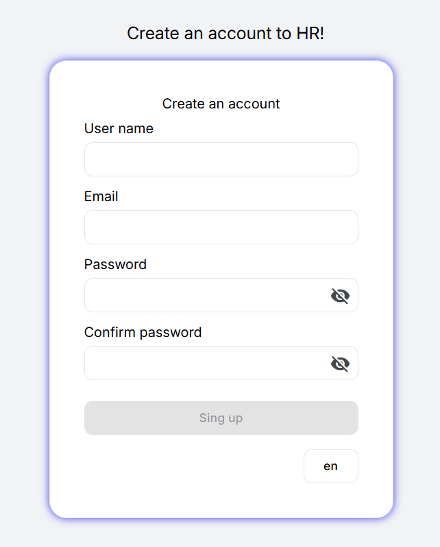 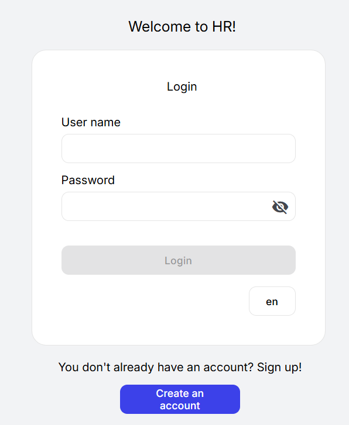

#### *Manage employees and requests time off* #####
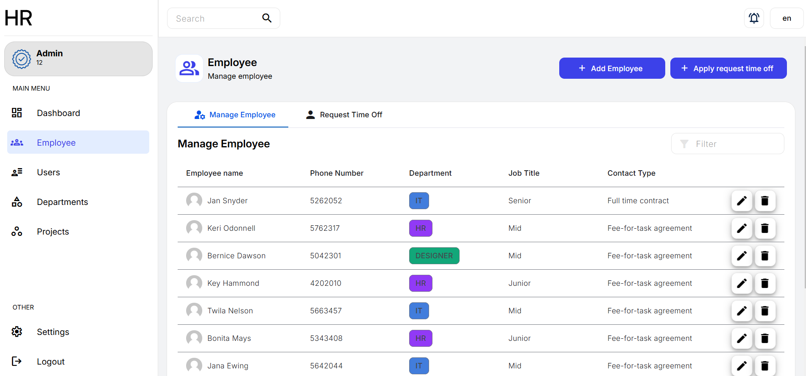 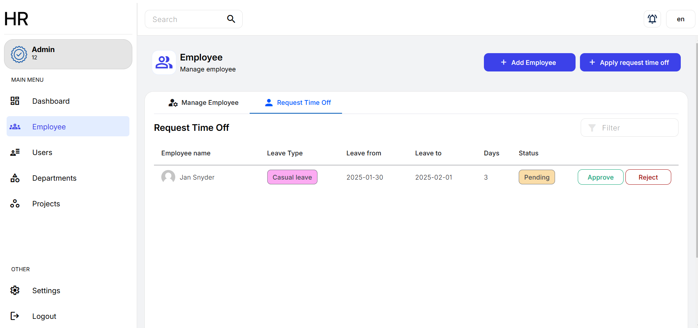

#### *Manage users* #####
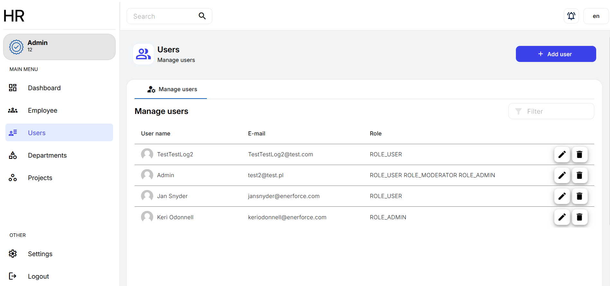

#### *Manage projects* #####
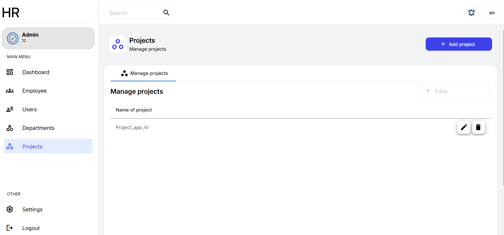

#### *Manage projects by Id* #####
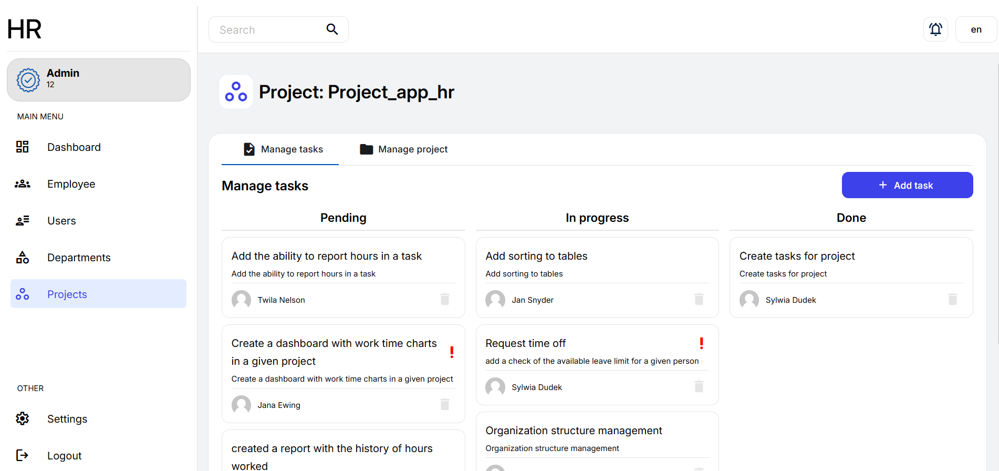 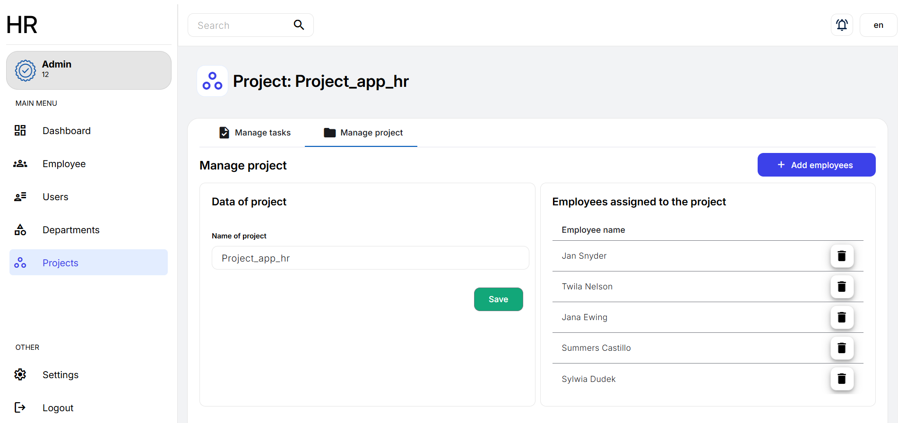 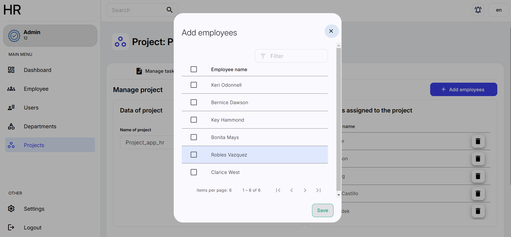

#### *Task* #####
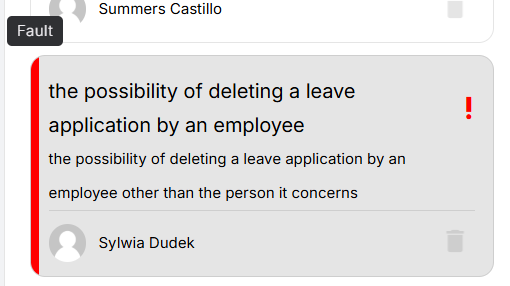 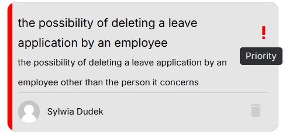

#### *Notification* #####
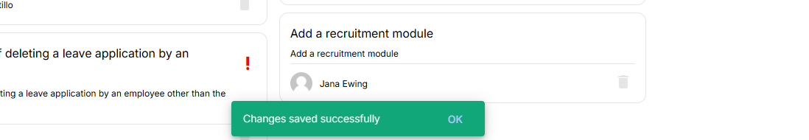
